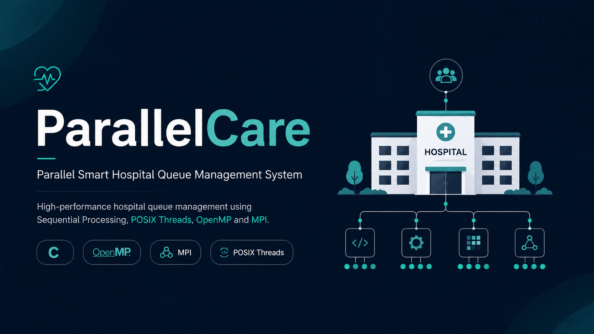
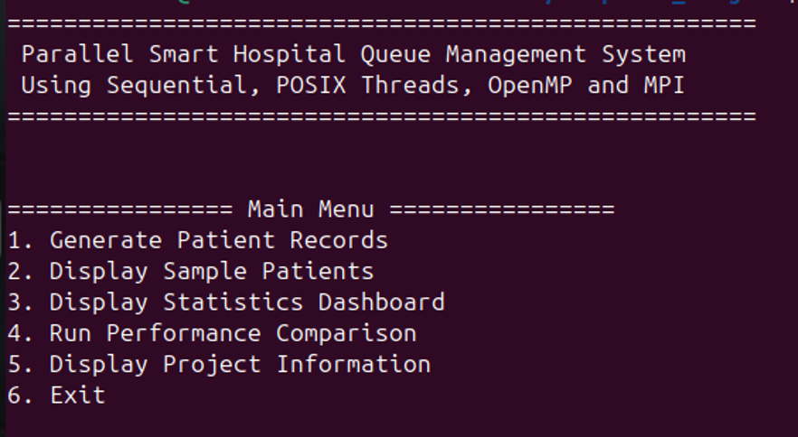
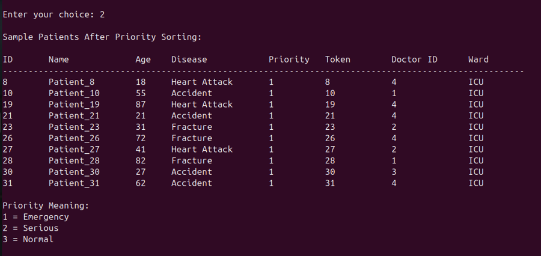
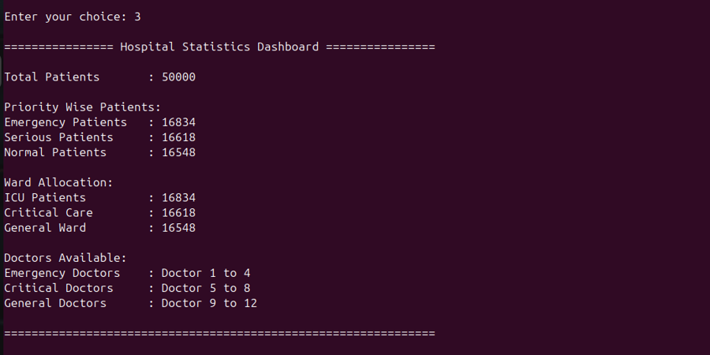
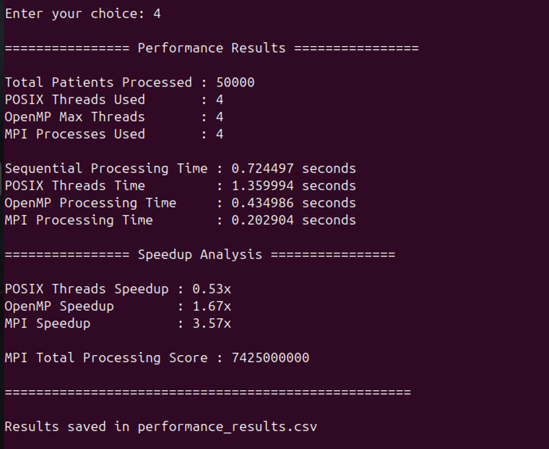

# 🏥 Parallel Care  
### Parallel Smart Hospital Queue Management System

A high-performance hospital queue management system built in C that demonstrates **parallel computing concepts using Sequential Processing, POSIX Threads, OpenMP, and MPI**.

The system simulates real-world hospital patient management with priority-based scheduling, doctor assignment, ward allocation, and performance benchmarking across multiple parallel programming models.

---

  

---

## 🚀 Features

- 👨‍⚕️ Patient record generation (50,000 records)
- 📊 Priority-based queue sorting (Emergency / Serious / Normal)
- 🏥 Automatic doctor & ward assignment
- 📈 Hospital statistics dashboard
- ⚡ Multi-model processing:
  - Sequential Processing
  - POSIX Threads (Pthreads)
  - OpenMP Parallel Processing
  - MPI Distributed Processing
- 📉 Performance comparison & speedup analysis
- 💾 CSV export of benchmarking results

---

## 📸 Preview

### 🏠 Main Menu

### 📊 Priority Management

### 📈 Statistics Dashboard

### ⚡ Performance Results

---

## 🧠 Core Concepts Used

- Parallel Programming
- Multithreading (Pthreads)
- Shared Memory Parallelism (OpenMP)
- Distributed Computing (MPI)
- Performance Benchmarking
- Queue Management Systems

---

## 👤 Author

**Areef Rasool**

BSAI Student | AI, Data Science & Networking Enthusiast

---

## 📄 License

This project is open-source and available under the [MIT License](LICENSE).
